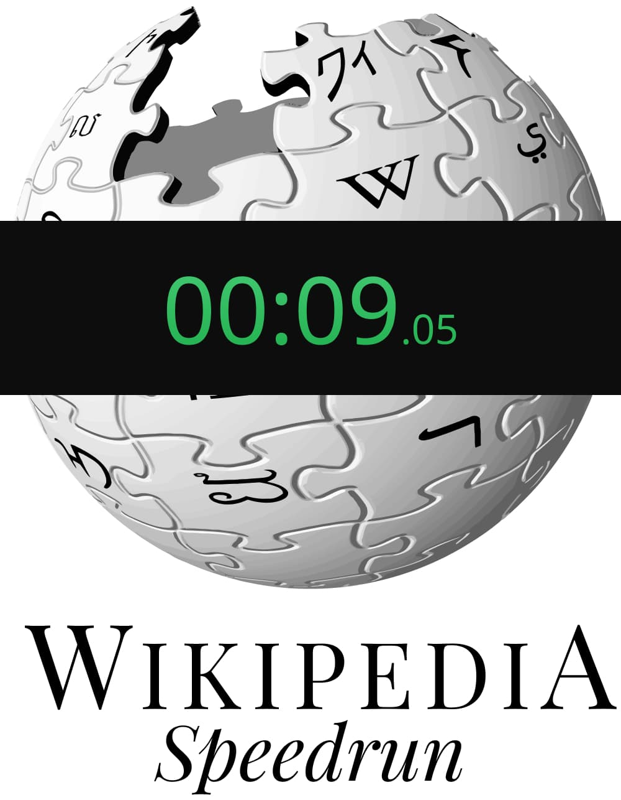

<p align="center">
  
</p>

<p align="center">
  [](https://app.netlify.com/sites/wiki-speedrun-es/deploys)>
  &nbsp
  [](https://opensource.org/licenses/MIT)
</p>

# 🏁 Wikipedia Speedrun Game - Spanish version

The goal of the game is to navigate from a starting wikipedia article to another one, in the least amount of clicks and time.

Based on wikispeedrun by B0und found [Here](https://github.com/B0und/WikiSpeedrun)

[Juega ahora / Start playing now! (Spanish version)](https://wiki-speedrun-es.netlify.app/)
[Start playing now! (Original english version by B0und)](https://wikispeedrun.org/)

## Features

- ▶ No registration required

- 🧭 Choose your own prompts

- ⏱ High precision fair™ timer

  - actually **stops** while you are loading the next article

- 💣 Optional Time Limit

- ✅ Keeps track of your session progress

- 👀 Open source

## Technologies used

- React
- Redux
- React-router
- Create React App
- Emotion
- Reach UI, Mantine

## Build it yourself

This project was created with [Create React App](https://github.com/facebook/create-react-app).

Clone the project:

```
git clone https://github.com/htorresbobbio/wikispeedrun-es.git
```

In the project directory you can run `npm i` and then:

### `npm start`

To run the app in the development mode.

### `npm run build`

To build the app for production to the `build` folder.

## License

MIT
